# Welcome

RestoRant is a site where users 'rant' and 'rave' about their experiences and opinions about the restaurants they have visited.

This was a simple-enough coding project for Year 1.2 of poly. Although this is not going to be proposed or to be released in the long run, I hope you enjoy testing this portable website, and appreciating the time I took to code all of this.

## Getting started

There're a few things you need to do in order to setup your project. This is exactly how I did it when I was in poly.

### Software and Database

1. Get XAMPP, VS Code and MySQL installed. Pin these applications to your taskbar for easier access.
2. Open XAMPP Control and on the row that says MySQL, click "Start" to turn on MySQL.
3. Open and execute the two SQL files - restorant (main) and UpdateStats.sql.

### Setting up the website

You do not need to do steps 1-5 again.

1. If you may want, you can download Postman, which is a REST client.
2. To start the website, move the entire directory to a location which you may like.
3. Navigate one step back and right click until you see "Open in Code".
4. On this directory, unarchive the two zip files "node-modules" and "images". When unarchiving, override the parent folder.
5. Leave the node-modules folder where it is. Move the images folder to the directory `/public/images`.

6. When you are done, go back to/open VS Code, open the Terminal and type in the command `node server.js` to start the website.
7. Look out for the link `http://127.0.0.1:8080` (port numbers may change) and go to the browser of your choice. Happy exploring!

## Screenshots
### Home Page

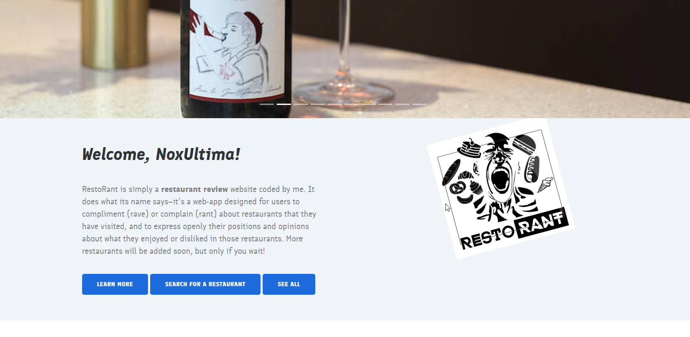
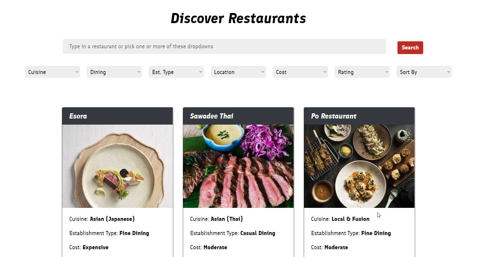

### Search & Restaurant Pages
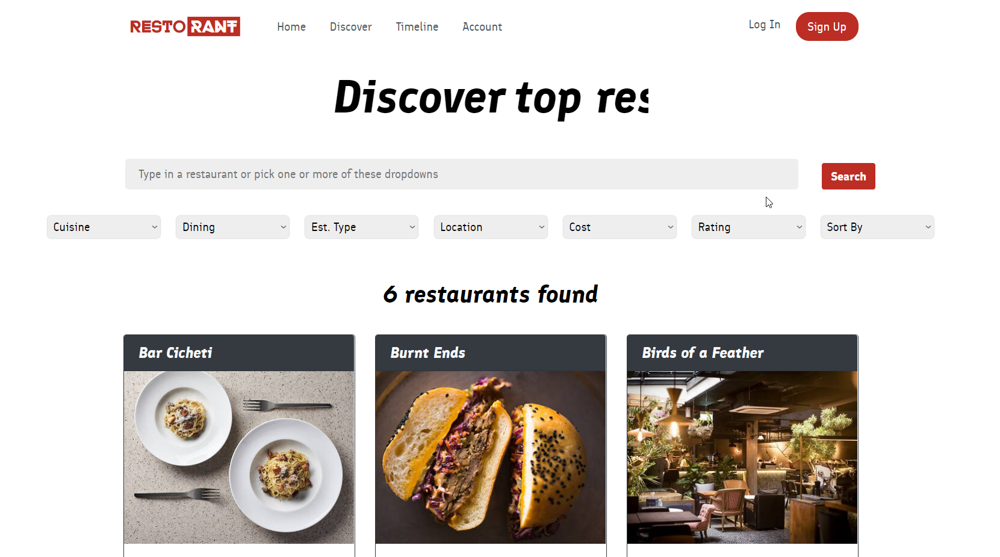
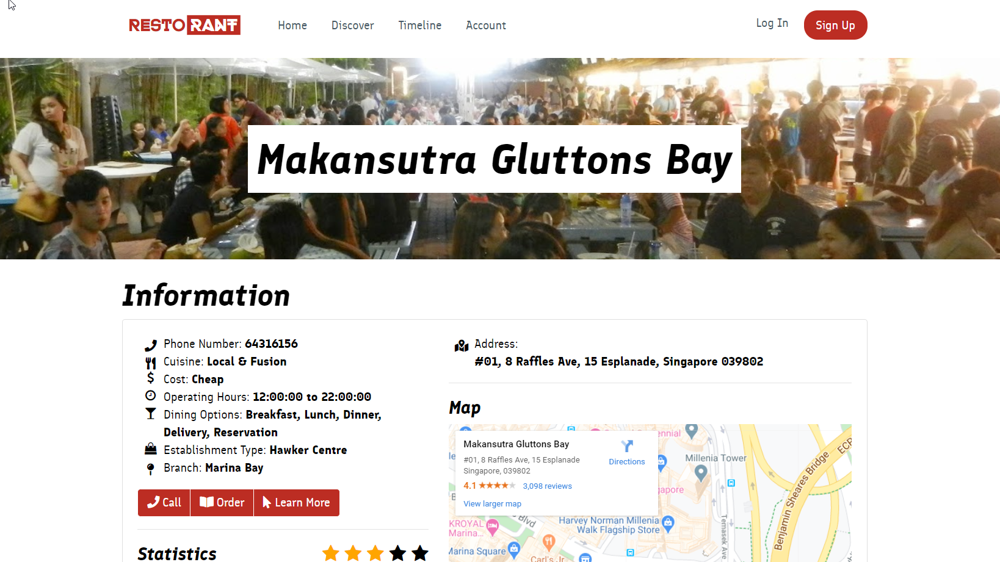

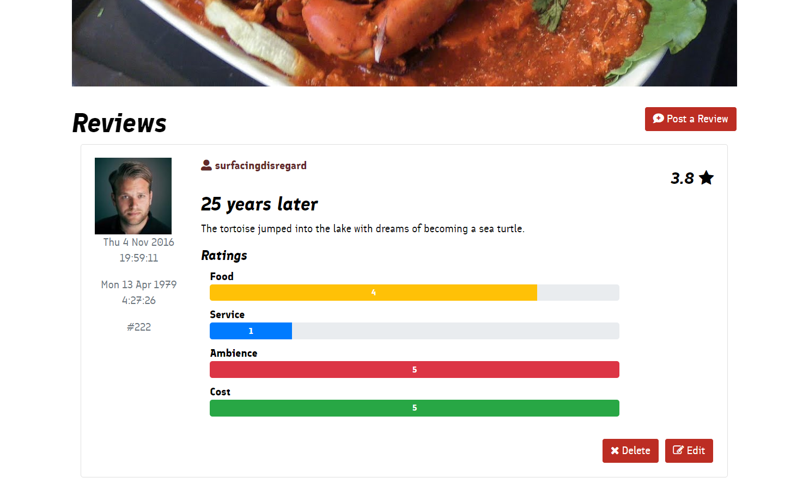

### Timeline & Account Pages
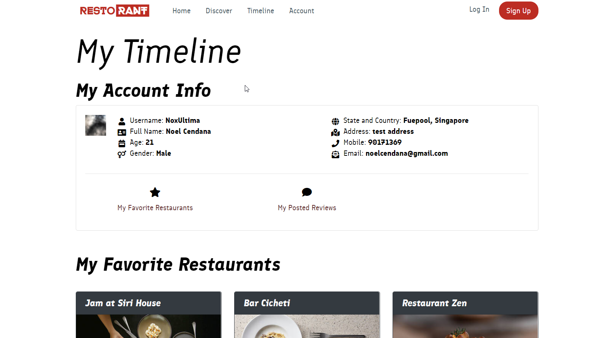
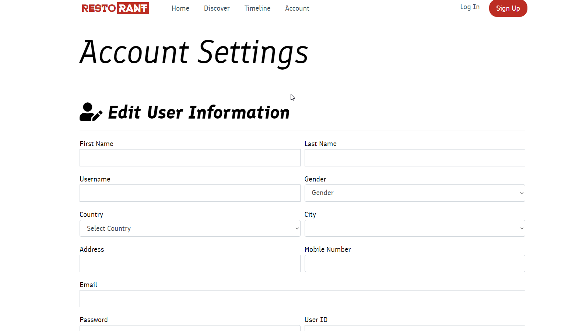
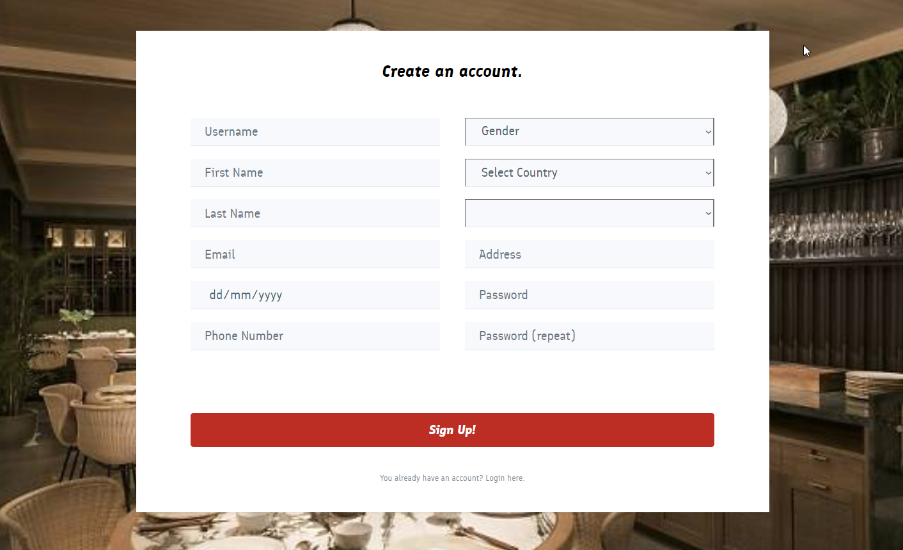

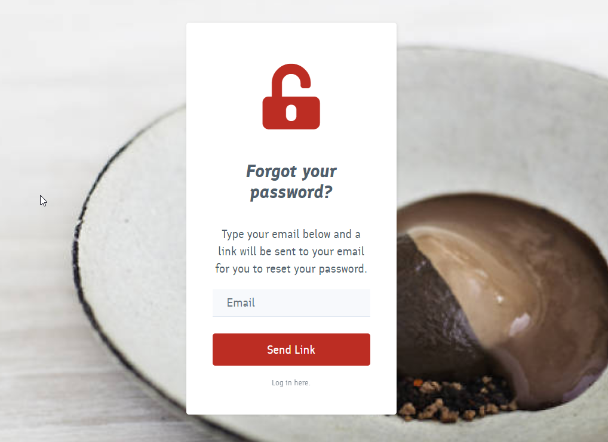
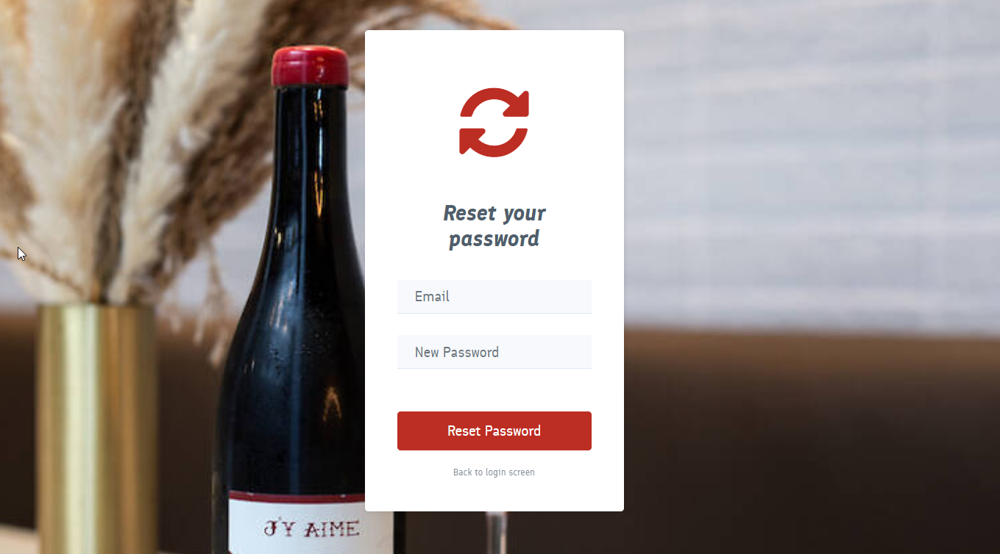

### About Page
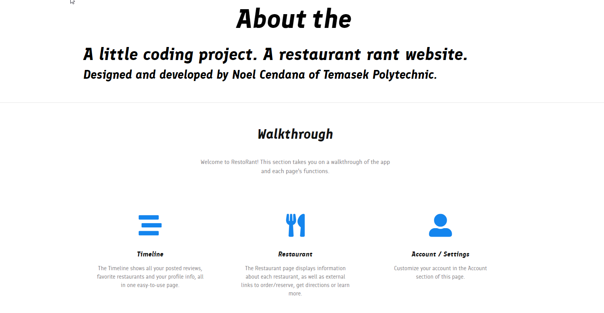
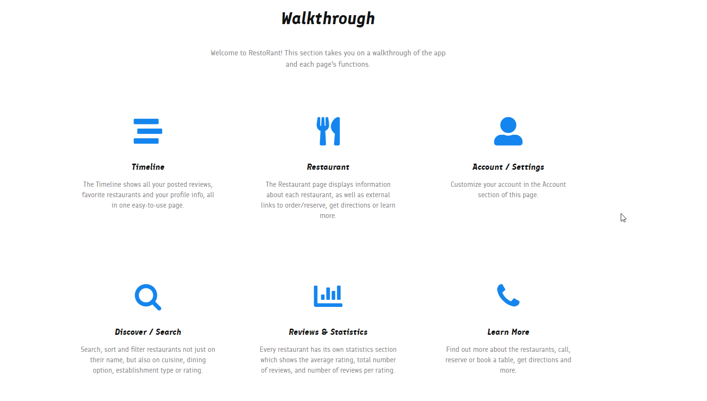
